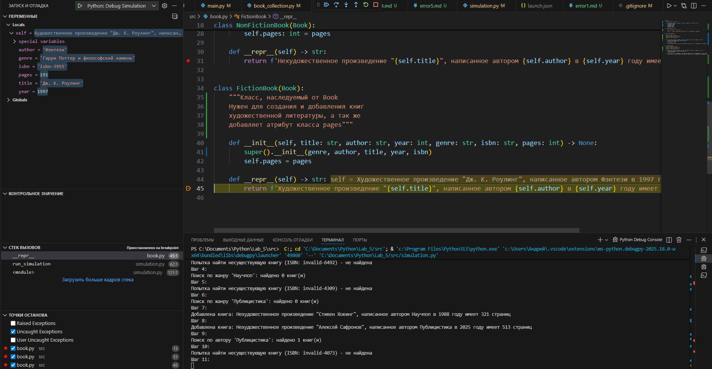

# Лабораторная работа № 5: Отладĸа ĸодовой базы проеĸта на Python с помощью средств отладĸи

## Ошибка 1 - ошибка удаления книги из пустой библиотеки

### Место: simulation.py
### Симптом:
Программа падает с `IndexError`, если событие `remove_book` происходит, когда в библиотеке нет книг.

### Как воспроизвести:
Запустить `python .\src\simulation.py 20 11`

### Откладка: 
При выполнения действия `remove_book`(то есть удаления книги из билиотеки) в `simulator.py` выбрасывается ошибка `IndexError`.


### Причина:
Отсутствует проверка `if len(library.index.ISBN) == 0:` перед вызовом `random.choice([])`, что вызывает ошибку.

### Исправление:
Добавлена проверка длины списка перед удалением книги:
```
if len(library.books) == 0:
    print("Нет книг для удаления")
```

### Проверка:
Поведение симуляции соответствует ожидаемому: при удалении книги сначала проверяется, что билиотека не пуста, а затем уже ищется книга по isbn-коду. Программа не падает с ошибкой `IndexError`

### Доказательства:
Вывод ошибки:
](report_png/1-1.png)

Код до исправления:
](report_png/1-2.png)

## Ошибка 2 - изменение пользовательской коллекции во время итерации

### Место: library.py, метод find_by_genre()
### Симптом:
Программа зависает при поиске по жанру, запускается бесконечный цикл.

### Как воспроизвести:
Запустить  `python .\src\simulation.py 25 42`

### Откладка: 
Установлен breakpoint на строке `self.books.insert(0, book)` в методе `find_by_genre()` класса `Library`.

### Причина:
При вставке книги в начало `self.books` во время итерации по списку происходит зацикливание, тк итератор возращается к одной и той же позиции при вставке книги в начало.

### Исправление:
Добавлена безопасная реализация без изменения `self.books` во время итерации:
```
def find_by_genre(self, genre: str) -> list[Book]:
    return [book for book in self.books if book.genre == genre]
```

### Проверка:
Поведение симуляции соответствует ожидаемому: не происходит добавления книги опять в `books` и поэтому отсутствует зацикливание.

### Доказательства:
Вывод ошибки:
](report_png/2-1.png)

Код до исправления:

](report_png/2-2.png)

## Ошибка 3 - неправильный формат передачи данных(года написания книги) 

### Место: simulation.py
### Симптом:
При поиске по году возникает `ValueError` с сообщением "invalid literal for int() with base 10"

### Как воспроизвести:
Запустить  `python .\src\simulation.py 20 12`

### Откладка: 
Выпадает ошибка `ValueError` в строчке `correct_year = int(valid_year)` в функции `run_simulation`.

### Причина:
Попытка преобразовать строку, содержащую текст "год", в целое число с помощью функции int(), которая поддерживает только числовые значения.

### Исправление:
Используется исключительно числовое значение для обозначения года выпуска книги:
```
elif choice == "year" and library.index.year:
                year = random.choice(list(library.index.year.keys()))
                books = library.find_by_year(year)
                print(
                    f"Поиск по году {year}: найдено {len(books)} книг(и)")
```

### Проверка:
Поведение симуляции соответствует ожидаемому: в пременную года создания передается исключительно числовое значение.

### Доказательства:
Вывод ошибки:
](report_png/3-1.png)

Код до исправления:

](report_png/3-2.png)


## Ошибка 4 - логическая ошибка при создании художественной/нехудожественной книги

### Место: simulation.py, функция generate_book()
### Симптом:
Все книги в библиотеке имеют приписку "Художественная", хотя должны быть как художественные, так и нехудожественные произведения.

### Как воспроизвести:
Запустить  `python .\src\simulation.py 20 15`

### Откладка: 
Установлен breakpoint на строке `if title == "Краткая история времени" and title == "Большая советская экономика":`. В выводе симуляции видно, что книга "Большая советская экономика" имеет приписку "Художественная", что неправильно.

### Причина:
Логический опреатор `if` требует выполнения двух одновременных выполнения условий названия для книги, что невозможно.

### Исправление:
Мы меняем `and` на `or`, что проверяет, что книг может быть с одним названием или с другим, а не с двумя одновременно, что невозможно:
```
if title == "Краткая история времени" or title == "Большая советская экономика":
        """
        Проверяем, является ли книга худ. литературой
        """
        return NonFictionBook(title, author, year, genre, isbn, pages)
    else:
        return FictionBook(title, author, year, genre, isbn, pages)
```

### Проверка:
Поведение симуляции соответствует ожидаемому: книги с названием "Краткая история времени" или "Большая советская экономика" bvt.n ghbgbcre "Нехудожественная".

### Доказательства:
Вывод ошибки:
](report_png/4-1.png)

Код до исправления:

](report_png/4-2.png)

## Ошибка 5 - перепутанны поля объекта  

### Место: book.py, класс Book и наследуемые от него классы
### Симптом:
Неправильное отображение книг: в Book в поле title хранится автор, в поле author - название книги, в поле genre - год создания книги, в поле year - жанр. А наследуемые классы  FictionBook и NonFictionBook передают в родительский конструктор genre как title, author как author(но это уже жанр), title как year и year как genre.

### Как воспроизвести:
Запустить  `python .\src\simulation.py 20 11`

### Откладка: 
Установлены breakpoints на строках вовзращаемых строк в магическом методе `__repr__` в классах Book, FinctionBook и NonFictionBook.

### Причина:
В конструкторах класса Book и наследуемых классах FInctionBook и NonFictionBook перепутаны аргументы при присваивании значений полям объекта.

### Исправление:
Каждому полю объекта подобрать правильное значение
```
class Book:
    """Создание базового класса"""
    def __init__(self, title: str, author: str, year: int, genre: str, isbn: str) -> None:
        self.title = title
        self.author = author
        self.year = year
        self.genre = genre
        self.isbn = isbn

    def __repr__(self) -> str:
        """
        Вывод определенных атрибутов класса
        """
        return f'Произведение "{self.title}", написанное автором {self.author} в {self.year}'
```

### Проверка:
Поведение симуляции соответствует ожидаемому: каждое поле объекта имеет корректное значение.

### Доказательства:
Вывод проблемы:
](report_png/5-1.png)

](report_png/5-2.png)




Код исправления:
](report_png/5-4.png)


